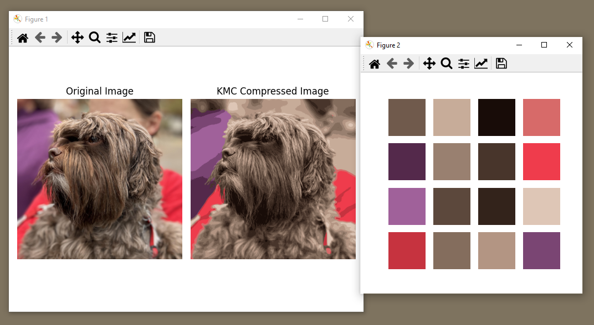

### KMeans Image Compression

This script compresses images using the KMeans clustering algorithm to identify 16 major colors in the image and reduces the number of colors to those 16. It supports saving and loading compressed/uncompressed images in a custom KMC file format.

## Features
- **Convert to KMC16**: Compresses an image to use only 16 colors.
- **Convert from KMC16**: Reconstructs an image from a compressed KMC format.
- **Save KMC Image**: Saves a compressed image to disk in the KMC format.
- **Load KMC Image**: Loads a compressed image from disk in the KMC format.

## Setup
Necessary Packages:
- Python 3.x
- numpy
- matplotlib
- scikit-learn

1. **Clone the Repository**: 
  ```bash
  git clone https://github.com/Awnder/kmeans_compression.git
  cd kmeans_compression
  ```

2. Install requirements using pip:
  ```bash
  pip install numpy matplotlib scikit-learn
  ```

## Usage
The script can be executed from the command line with the following options:

- `<action>`: The action to perform, either `load` or `save`.
- `<filename>`: The name of the file to load or save.

### Example Commands
```sh
python kmcimage.py save example.png
python kmcimage.py load example.kmc
python kmcimage.py --help
```

## KMC File Format
The KMC file format includes:
- A 4-byte header: `KMC:`
- A 2-byte unsigned integer for width
- A 2-byte unsigned integer for height
- A 16x3 byte RGB color palette
- Pixel byte pairs, where the high nibble is the first pixel and the low nibble is the second

## Notes
- This is a lossy compression algorithm, meaning some image quality is sacrificed for reduced file size.
- The script includes a demonstration of the original and compressed images using matplotlib.

## Attributions
- Thanks to Professor Tallman who provided the system argument logic, plotting, and his dog
